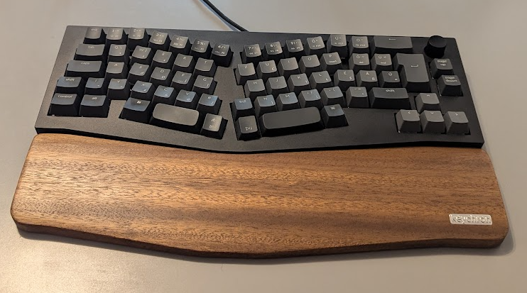
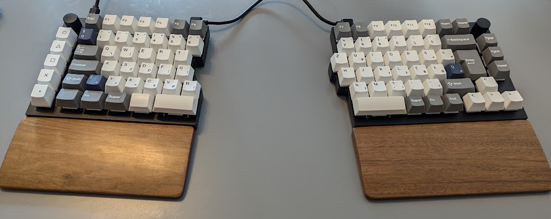

# QMK Layouts

Automating the installation and setup of QMK on **Debian**-based systems, and flashing firmware with my own **custom keymap** layouts.

## Install QMK

Install QMK firmware, then run `qmk setup` to install the necessary dependencies.

```bash
make install
```

Set up this repository as [_userspace_](https://docs.qmk.fm/newbs_external_userspace#external-userspace-repository-setup-forked-on-github) before compiling any firmware, for the accessibility of the layouts.

```bash
make setup
```

## Keychron Q8-F1 (ISO Encoder)



Compile the keyboard firmware with the new layout.

```bash
make q8-compile
```

Flash the firmware to the keyboard. [Factory reset guide](https://keychron.com.au/blogs/archived/how-to-factory-reset-or-flash-firmware-for-your-keychron-q8-keyboard).

```bash
make q8-flash
```

## Keychron Q11-M3 (ISO Encoder)



Compile the keyboard firmware with the new layout.

```bash
make q11-compile
```

Flash the firmware to the keyboard. [Factory reset guide](https://keychron.ca/pages/how-to-factory-reset-or-flash-firmware-for-your-keychron-q11-keyboard).

```bash
make q11-flash
```
